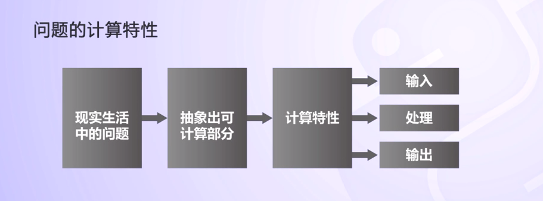

# Python 旅程

## 程序设计思维（基本方法）

**程序的基本编写方法**

**IPO模式**

* I: `Input` 输入，程序的输入
* P： `Process` 处理，程序的主要逻辑
* O: `Output` 输出， 程序的输出

**理解IPO模式**
* 输入
    * 程序的输入包括：文件输入、网络输入、用户手工输入、随机数据输入、程序内部参数输入等
    * 输入是一个程序的开始
* 输出
    * 程序的输出包括： 屏幕显示输出、文件输出
    、网络输出、操作系统内部变量输出等
    * 输出是一个程序展示运算成果的方式
* 处理
    * 程序对输入进行处理输出产生结果
    * 处理的方法也叫算法，是程序最重要的部分    

**理解问题的计算部分**

问题的计算特性： 问题计算部分指一个待解决问题中，可以用程序辅助完成的部分。

实例来理解计算特性：温度转换问题，美国国喜欢用`华氏温度`度量问题，中国喜欢用`摄氏温度`来度量，对于双方去对方的国家旅游是需要进行温度转换来知晓天气状况。

> 分析计算部分，通过计算技术解决温度转换

* 方法一： 根据两种温度转换公式，写一个温度转换的程序，由人把温度输入，程序将转换后的温度输出。
* 方法二： 网络上类似的在线程序，写一个网络程序，把人输入的温度发送到互联网上，获得转换结果后输出。（问题的重点不在计算和转换，而在于发送和获取）
* 方法三： 写一个程序，通过GPS定位，获得使用者当前的位置，再通过网络获取当前的位置的温度信息，自动进行转换。
* 方法四： 写一个程序，监听温度信息发布渠道，比如收音机、电视等；通过语音识别、图像识别等方法自动获得温度信息的数值，自动完成转换。
* 方法还有很多种，不要局限固定的思维，多开开脑洞。

**程序编写的步骤**

* 分析问题：分析问题的计算部分 
* 确定问题：将计算部分划分为确定的IPO三部分
* 设计算法：完成计算部分的核心处理方法
* 编写程序：实现整个程序
* 调试测试：使程序在各种情况下都能够正确运行
* 升级维护：使程序长期正确运行，适应需求的微小变化

**问题：** 如何利用Python程序今夕摄氏度和华氏度的转换

* 步骤一： 分析问题的计算部分(转换公式，需要了解华氏和摄氏温度值的理念)
* 步骤二： 确定功能，使用IPO方法进一步分析
          输入： 华氏或者摄氏度值、温度标识
          处理： 温度转化算法
          输出： 摄氏或者华氏温度值、温度标识
          F标识华氏度 82F表示华氏度82度
          C标识摄氏度 28C表示28摄氏度
* 步骤三： 设计算法
          根据华氏和摄氏温度定义，单位刻度对应温度关系的转换公式：
          C = （F - 32） / 18
          F =  C * 1.8 + 32
* 步骤四： 编写程序（19行）
* 步骤五： 调试、运行程序
          在系统命令上通过如下命令执行程序：
          C:\> python TempConvert.py
          或者：使用IDLE打开上述文件，按F5运行（推荐）
 * 步骤六：升级维护

 **简化步骤**  至少需要3个步骤

 * 步骤一： 确定IPO
 * 步骤二： 编写程序
 * 步骤三： 调试运行程序

 

